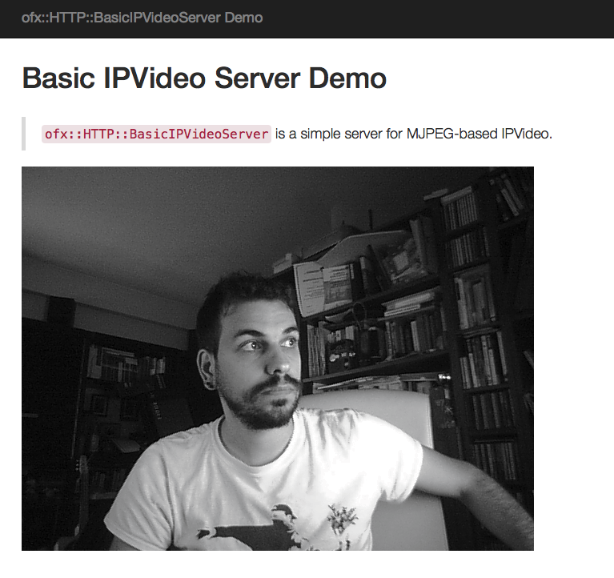

# home-hacks
A list of useful hacks!

1. **example_basic_server_mjpeg_video** : an openframeworks app that sends a webcam feed from a server to a client.
Tested on ubuntu 16.04 using the PS3 eye camera. It builds on top of the mjpeg example contained in ofxHTTP.

You just need to visit the address of the server computer in order to view the webcam feed (15fps in order to reduce latency):

